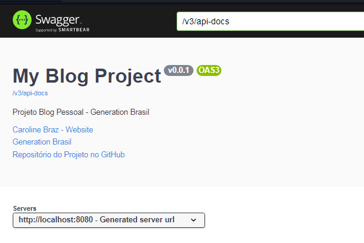
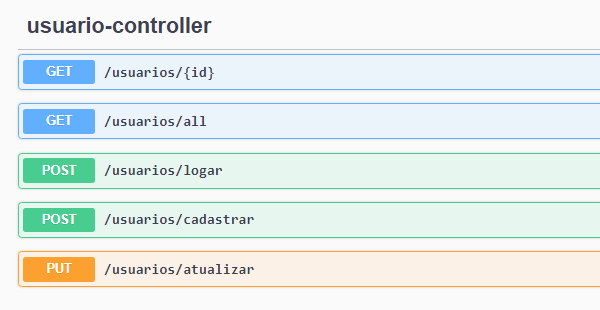
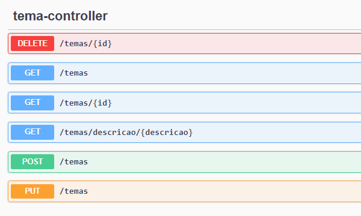
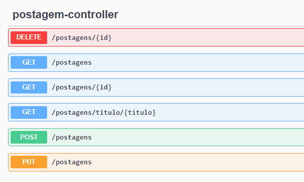
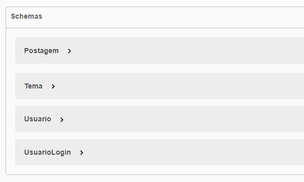

<h5 align="right">
	This file is also available in <a href=https://github.com/carolinebraz/my-blog/blob/main/README.md> English </a> :us:
</h5>

# <p align="center"> My Blog :pencil: </p>

Back-end do projeto Blog Pessoal desenvolvido em `Spring Boot + Maven + Java` durante o curso de Desenvolvimento Web Full Stack da Generation Brasil.

• [Funcionalidades](#funcionalidades-sparkles)
• [Imagens](#imagens-art)
• [Requisitos](#requisitos-warning)
• [Tecnologias](#tecnologias-computer)
• [Executando o aplicativo](#executando-o-aplicativo-arrow_forward)
• [Deploy](#deploy-rocket)
• [Licença](#licença-lock)

### Funcionalidades :sparkles:  
- [x]  Criação de banco de dados relacional (MySQL, H2 e PostgreSQL)
- [x]  Modelo de arquitetura MVC (Model-View-Controller)
- [x]  Cadastro, edição, atualização e exclusão de temas e postagens (CRUD completo)
- [x]  Cadastro, edição e atualização de perfil do usuário (CRUD parcial)
- [x]  Validação de acesso por token (JWT)
- [x]  Testes unitários para recursos do usuário (JUnit)
- [x]  Testes de requisições HTTP (Insomnia)
- [x]  Documentação de API REST com Swagger

### Imagens :art:  
API Doc | Usuários | Temas | Postagens | Schemas
:---:|:---:|:---:|:---:|:---:
 |  |  |  | 

Para mais detalhes, [execute a aplicação](#executando-o-aplicativo-arrow_forward).

### Requisitos :warning: 
Para o desenvolvimento é necessário instalar em sua máquina uma ferramenta de versionamento de código, um kit de desenvolvimento de software Java (SDK), um ambiente de desenvolvimento integrado (IDE), um sistema de gerenciamento de banco de dados (SGBD) e uma ferramenta de testes de API.

- [Git](https://git-scm.com/)
- [JDK ^ 17.0.7](https://www.oracle.com/java/technologies/javase/jdk17-archive-downloads.html)
- [Spring Tool Suite ^ 4.18.1](https://spring.io/tools)
- [MySQL Workbench ^ 8.0.33](https://dev.mysql.com/downloads/workbench/)
- [Insomnia](https://insomnia.rest/download)

Nas configurações do <b>MySQL Workbench</b> certifique-se de utilizar o nome de usuário e a senha padrão ambos igual a `root` ou será necessário alterar essas informações no arquivo `application-dev.properties` mais tarde.

### Tecnologias :computer:
- [Spring Boot](https://spring.io/projects/spring-boot)
- [Spring Data JPA](https://spring.io/projects/spring-data-jpa)
- [Spring Security](https://spring.io/projects/spring-security)
- [Hibernate](https://hibernate.org/)
- [JSON Web Tokens](https://jwt.io/introduction)
- [JUnit](https://junit.org/junit5/docs/current/user-guide/)
- [Swagger](https://swagger.io/)

### Executando o aplicativo :arrow_forward:  
1. Clone o projeto  

    ```
    git clone https://github.com/carolinebraz/my-blog.git  
    ```

2. Abra o <b>Spring Tool Suite (STS)</b> e importe o projeto  

    ```
    File >>> Open Projects from File System... >>> Directory... >>> Selecionar pasta "my-blog" >>> Finish  
    ```

3. Abra o arquivo <b>applications.properties</b> e altere-o para o perfil de desenvolvimento   

    ```
    my-blog/src/main/java/resources/applications.properties   
    ```

    Na primeira linha, troque a palavra `prod` por `dev` conforme o código abaixo
   
    ```
    spring.profiles.active=dev
    ```

    Salve o arquivo

4. Atualize o projeto Maven para evitar possíveis falhas de execução
   
    ```
    Utilize o atalho alt+F5
    
    Certifique-se de que o projeto "my-blog" encontra-se selecionado
    
    Acione a caixa de seleção "Force Update of Snapshots/Releases"
    
    Clique em OK
    ```

5. Na aba <b>Package Explorer</b> selecione a pasta do projeto e execute a aplicação como `Spring Boot App`. Para isso você pode utilizar o atalho
   
    ```
    Alt + Shift + X, B
    ```

   Caso ocorra uma falha relacionada ao banco de dados durante a execução, verifique as informações de usuário e senha. Se durante a instalação você configurou o <b>MySQL</b> com usuário e senha diferentes de `root`, agora é o momento de alterá-los nas linhas 4 e 5 do arquivo `application-dev.properties`

   ```
   spring.datasource.username=root
   spring.datasource.password=root
   ```
   
   Salve e tente executar a aplicação novamente
   
   Para demais falhas encontradas, você pode relatar o [problema](https://github.com/carolinebraz/my-blog/issues) neste repositório

7. Abra o <b>Insomnia</b>, altere o método <b>GET</b> para <b>POST</b> e digite na barra de endereços a seguinte URL 

    ```
    http://localhost:8080/usuarios/cadastrar
    ```

   Selecione <b>JSON</b> dentre as opções de corpo da requisição (Body) e digite as informações do usuário

    ```
    {
        "nome": "Root",
        "usuario": "root@root.com",
        "senha": "rootroot",
        "foto": ""
    }
    ```

   Clique em Enviar
   
   Se estiver tudo correto, você receberá como resposta o código `201 Created` que indica que o usuário foi cadastrado com sucesso.

7. Navegue para o localhost do projeto
   
	- [http://localhost:8080/](http://localhost:8080/)

   Digite os dados do usuário (email e senha) cadastrados anteriormente para logar

8. Agora é possível analisar todos os endpoints da aplicação e testá-los diretamente no navegador através do Swagger 😃

<h4>*** É importante ressaltar que o cadastro do usuário pelo Insomnia (ou outro software de testes de API) deve ser realizado enquanto a aplicação é executada no STS, caso contrário não será possível inserir as informações no banco de dados. O mesmo vale para as demais requisições a serem feitas na API. ***</h4> 

### Deploy :rocket:
Esse projeto encontra-se temporariamente hospedado de forma gratuita nos servidores do [Render](https://render.com/) e do [Vercel](https://vercel.com/).

- Back end: [https://myblog-bfkt.onrender.com/](https://myblog-bfkt.onrender.com/)
- Front end: [https://my-blog-app-lilac.vercel.app/](https://my-blog-app-lilac.vercel.app/)

### Licença :lock:
Copyright &copy; 2023 - Caroline Braz

[Licença MIT](./LICENSE)
