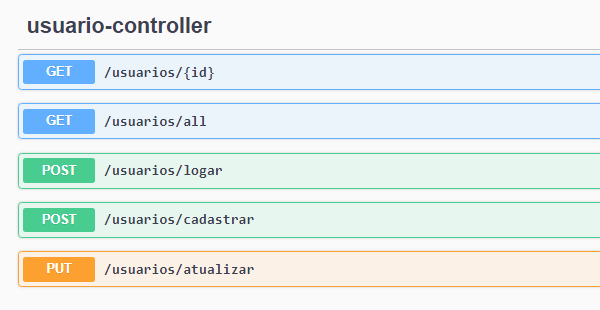
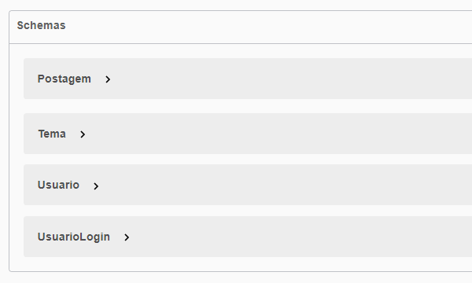

<h5 align="right">
	Este arquivo também está disponível em <a href=https://github.com/carolinebraz/my-blog/blob/main/README-pt.md> Português </a> :brazil: 
</h5>

# <p align="center"> My Blog :pencil: </p>

Back-end of the Personal Blog project developed using `Spring Boot + Maven + Java` during the Full Stack Web Development course at Generation Brazil.

• [Features](#features-sparkles)
• [Layout](#layout-art)
• [Prerequisites](#prerequisites-warning)
• [Technologies](#technologies-computer)
• [Run](#run-arrow_forward)
• [Deploy](#deploy-rocket)
• [License](#license-lock)

### Features :sparkles:  
- [x] Create relational database (MySQL, H2, and PostgreSQL)
- [x] MVC architecture model (Model-View-Controller)
- [x] Create, read, update, and delete themes and posts (complete CRUD)
- [x] Create, read, and update user profile (partial CRUD)
- [x] Access validation by token (JWT)
- [x] Unit tests for user resources (JUnit)
- [x] HTTP request testing (Insomnia)
- [x] API REST documentation with Swagger

### Layout :art:  
API Doc | Users | Topics | Posts | Schemas
:---:|:---:|:---:|:---:|:---:
 |  |  |  | 

For more details, [run the app](#run-arrow_forward).

### Prerequisites :warning: 
For development, it is necessary to install on your machine a code versioning tool, a Java software development kit (SDK), an integrated development environment (IDE), a database management system (DBMS), and an API testing tool.

- [Git](https://git-scm.com/)
- [JDK ^ 17.0.7](https://www.oracle.com/java/technologies/javase/jdk17-archive-downloads.html)
- [Spring Tool Suite ^ 4.18.1](https://spring.io/tools)
- [MySQL Workbench ^ 8.0.33](https://dev.mysql.com/downloads/workbench/)
- [Insomnia](https://insomnia.rest/download)

In the <b>MySQL Workbench</b> settings, make sure to use the default username and password, both set as `root`, or you will need to change this information in the `application-dev.properties` file later.

### Technologies :computer:
- [Spring Boot](https://spring.io/projects/spring-boot)
- [Spring Data JPA](https://spring.io/projects/spring-data-jpa)
- [Spring Security](https://spring.io/projects/spring-security)
- [Hibernate](https://hibernate.org/)
- [JSON Web Tokens](https://jwt.io/introduction)
- [JUnit](https://junit.org/junit5/docs/current/user-guide/)
- [Swagger](https://swagger.io/)

### Run :arrow_forward:
1. Clone the project  

    ```
    git clone https://github.com/carolinebraz/my-blog.git  
    ```

2. Open the <b>Spring Tool Suite (STS)</b> and import the project  

    ```
    File >>> Open Projects from File System... >>> Directory... >>> Select folder "my-blog" >>> Finish
    ```

3. Open the file <b>applications.properties</b> and change it to the development profile

    ```
    my-blog/src/main/java/resources/applications.properties
    ```
    
   In the first line, replace the word `prod` with `dev` as shown below.

    ```
    spring.profiles.active=dev
    ```
    
    Save the file

4. Update the Maven project to avoid possible runtime failures

    ```
    Use the shortcut alt+F5

    Make sure that the "my-blog" project is selected
	
    Check the "Force Update of Snapshots/Releases" checkbox
	
    Click OK
    ```

5. In the <b>Package Explorer</b>, select the project folder and run the application as a `Spring Boot App`. You can use the shortcut   

    ```
    Alt + Shift + X, B
    ```

   If a database-related failure occurs during execution, verify the username and password information. If you configured MySQL with different username and password during installation, now is the time to change them in lines 4 and 5 of the `application-dev.properties` file

   ```
   spring.datasource.username=root
   spring.datasource.password=root
   ```
   
   Save and try running the application again

   For other failures, you can report the [issue](https://github.com/carolinebraz/my-blog/issues)  in this repository

6. Open <b>Insomnia</b>, change the method from <b>GET</b> to <b>POST</b> and type the following URL in the address bar:

    ```
    http://localhost:8080/usuarios/cadastrar
    ```

   Select <b>JSON</b> from the request body options and type the user information:

    ```
    {
        "nome": "Root",
        "usuario": "root@root.com",
        "senha": "rootroot",
        "foto": ""
    }
    ```

   Click on Send
   
   If everything is correct, you will receive the response code `201 Created`, which indicates that the user was successfully registered

7. Navigate to the project's localhost
   
	- [http://localhost:8080/](http://localhost:8080/)

   Enter the user data (email and password) previously registered to log in

8. Now you can analyze all the application's endpoints and test them directly in the browser using Swagger 😃

<h4>*** It is important to highlight that the user registration through Insomnia (or other API testing software) must be done while the application is running on STS, otherwise it will not be possible to insert the information into the database. The same applies to the other requests to be made in the API. ***</h4>

### Deploy :rocket:
This project is temporarily hosted for free on the servers of [Render](https://render.com/) and [Vercel](https://vercel.com/).

- Back end: [https://myblog-bfkt.onrender.com/](https://myblog-bfkt.onrender.com/)
- Front end: [https://my-blog-app-lilac.vercel.app/](https://my-blog-app-lilac.vercel.app/)

### License :lock:
Copyright &copy; 2023 - Caroline Braz

[MIT License](./LICENSE)
